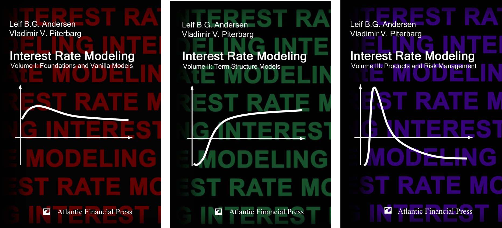

# Interest Rate Modeling 
## By Leif Andersen and Vladimir Piterbarg

This is a companion site to our three-volume set of books "Interest Rate Modeling"

## Buying the books
The books are widely available in online bookstores, for example
* [Volume 1 on Amazon.co.uk](https://www.amazon.co.uk/dp/0984422102)

## Contacting us
We welcome typo reports and general questions about the books via [email](mailto:authors@andersen-piterbarg-book.com)

## Errata
A list of typos and errors can be found [here](./media/TypoReport.xls). Fixes for the first printing that are too long for the typo report are here:
* [Proposition 4.5.2](./media/Prop_4_5_2_Fixed.pdf)
* [Proposition 7.6.6](./media/Proposition766Fixed.pdf)
* [Page 401](./media/p401-fixed.pdf)

## Other resources
* [Preface](./media/preface-20100817.pdf)
* [Table of contents](./media/toc-20100817.pdf)
* [Notations](./media/Notations.pdf)
* [Sample chapter](./media/Ch15_LMM1_Sample.pdf)
* [Index](./media/index_20100806.pdf)

## FAQ
* __When is the second edition coming?__
    * There are no plans currently for the second edition
* __Is there an electronic version I can buy?__
    * No, sorry

## Other links
* [L.Andersen SSRN page](https://papers.ssrn.com/sol3/cf_dev/AbsByAuth.cfm?per_id=111031)
* [V. Piterbarg SSRN page](https://papers.ssrn.com/sol3/cf_dev/AbsByAuth.cfm?per_id=73196)

## Other books by Atlantic Financial Press
* [Twenty Lectures About Gaussian Processes](https://www.amazon.co.uk/dp/B01HC9HFTU/ref=cm_sw_em_r_mt_dp_ynJDFbMGEHZJP)